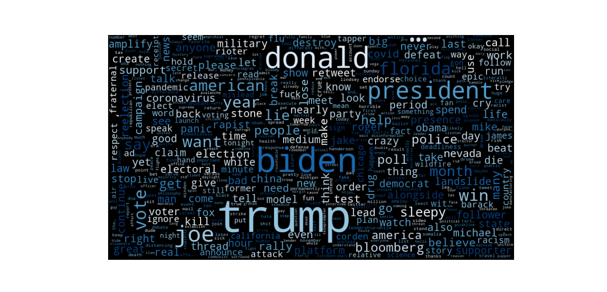
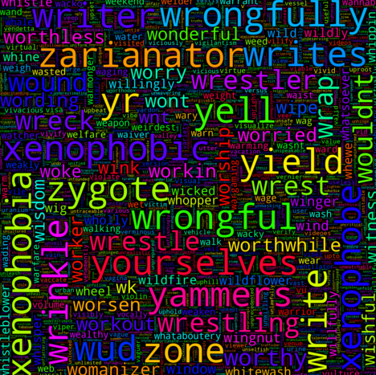

# Analyzing-Twitter-Data
Using Twitter data and python to analyze user sentiment towards presidential candidates.
### Word clouds for most used words in tweets about Biden, Trump, and the overall political word cloud

  

